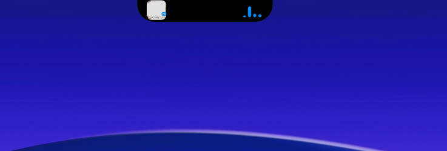
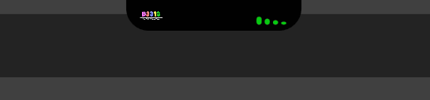

# notch

a mac-like notch / dynamic island but for windows. it sits at the top of your screen, shows whatever youre playing, reacts to your audio, and when you click it the whole thing expands into a full apple-music style player. i just wanted the dynamic island on my pc so i built it.

## what it does

- **now playing** from basically any app (spotify, cider, a youtube tab, whatever). it reads windows media stuff so theres no login or setup, it just works
- **click it and the whole notch expands** into an apple music live activity. big album art, a scrubber you can drag to seek, and shuffle / prev / play / next / repeat. it themes to the album art too
- **live visualizer** that reacts to your actual system audio. pick how many bars (up to 10), or switch it to a 9x9 grid of dots that expand with the sound
- **adaptive accent** that pulls a color out of the album art (toggle in settings)
- **airdrop-style catch**, when a file lands in your `Notch Drop` folder or you take a screenshot, a card drops down with the thing whooshing in and open / show buttons
- **recording pill**, a red REC dot with a running clock shows up while your screen is actually being captured (it ignores discord and other overlay apps so it doesnt lie to you)
- **download ring**, it slides out where the album art goes and spins while a download is running, then flashes a check when its done
- **right click** for a tabbed menu: countdown timer, system stats (cpu / gpu / ram), a file shelf, clipboard history, pinned apps, a calculator, a translator (translates whatever you last copied), and live network speed
- **weather on the notch** (optional, off by default), real rain or snow on the pill matching your actual weather
- **confetti** (optional, off by default) on big moments like a finished download or timer
- **privacy dots** for when your mic / cam / screen is in use (and it wont get stuck on anymore)
- **3d device cards** that pop with a spinning model when you plug something in (and you can hide the unknown ones)
- **notification pops** and a little copied flash when you copy text
- **grab it and stretch it** like on iphone, it springs back. theres a drag strength setting if you want it to go crazy (1x to 10x)
- **sizing** so you can match your real notch. i run mine at 90% width 75% tall cause thats about the real mac notch
- **a joke settings tab** cause why not

## install

grab the zip from [releases](../../releases), unzip it anywhere, run `Notch.exe`. thats it, no installer.

it lives in your system tray. left click the tray icon for all the settings (style, accent, size, all the toggles), theres a "start with windows" option in there too if you want it up every time.

## a couple notes

- windows only obviously
- some of the media stuff (seek, shuffle, repeat) depends on the app reporting it. spotify and cider are great, a random youtube tab might not support all of it, so those buttons just do nothing there
- the translator and weather need internet, they use free no-key services so theyre best effort. if you're offline they just quietly do nothing
- the recording pill uses the windows screen-capture signal, so obs display capture, snipping tool video and screen shares all trip it. nvidia shadowplay uses a different path so it wont, lemme know if you want that added
- its an overlay that stays on top and clicks through everything except the notch itself, so it wont get in your way

## made by

nontendo (github [SpaceyF](https://github.com/SpaceyF)). thats me. if you use it and it breaks or you want something added, open an issue and ill take a look.
